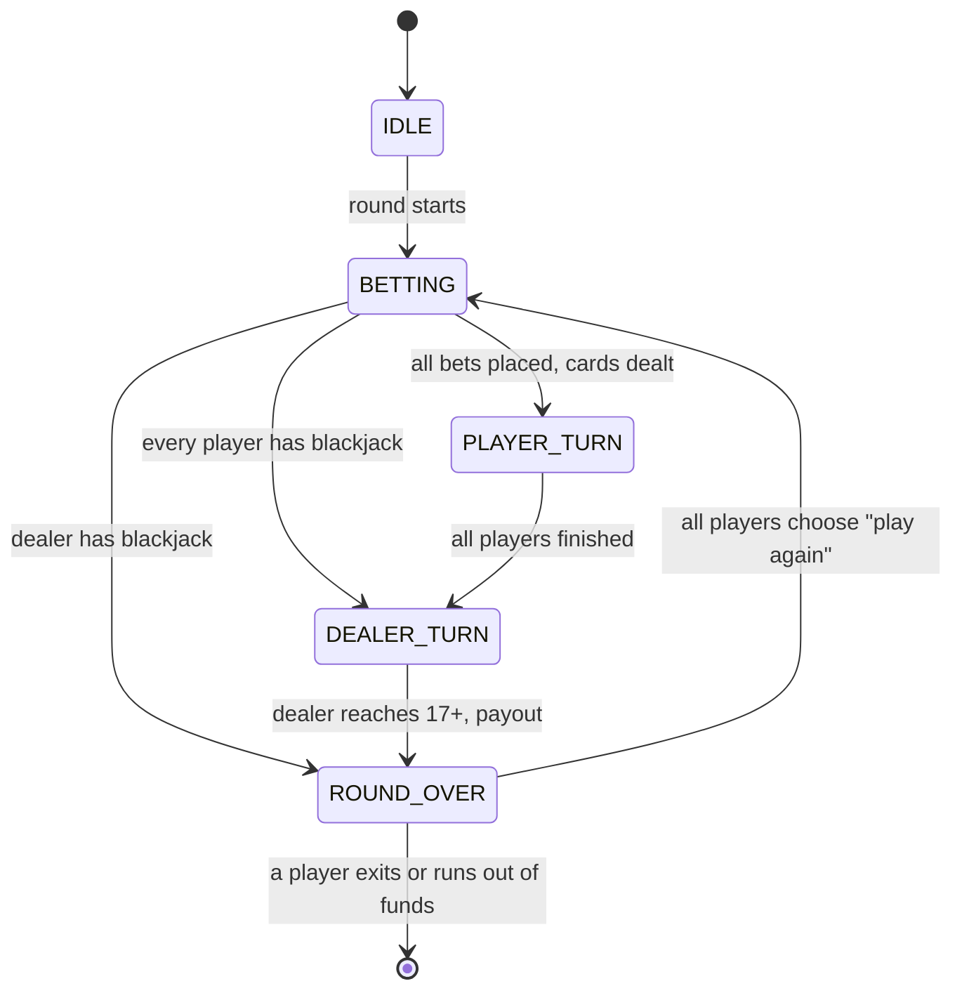
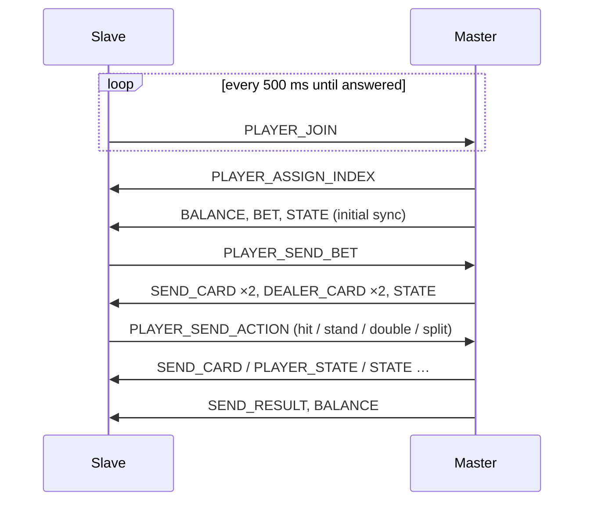

# Two-Player Blackjack on STM32 (MiŠKo 3)

A blackjack game in C for the **MiŠKo 3** development board (STM32G474). It runs either in
single-player mode or as a two-player game across two boards, connected wirelessly over
**HC-05 Bluetooth modules (UART)**. One board acts as the **master** and runs the game; the
other acts as the **slave** and mirrors the game state the master sends it.

Developed as a project for the course *Osnove mikroprocesorske elektronike* (Basics of
Microprocessor Electronics) at the Faculty of Electrical Engineering, University of Ljubljana, 2026.


▶ **Demo video:**

[DRAG AND DROP THE VIDEO HERE IN THE GITHUB EDITOR – GITHUB INSERTS THE LINK]

---

## Features

- **Blackjack rules:** hit, stand, double down and one split per round; blackjack pays 3:2; the dealer draws to 17
- **Hardware RNG:** the deck is shuffled with the Fisher–Yates algorithm using the STM32 hardware random number generator, and reshuffled when fewer than 26 cards remain
- **Three modes:** single player, master and slave, selected at start-up
- **Custom LCD graphics** (320×240, µGUI): card faces drawn from code, full-screen backgrounds, a hidden dealer card until the dealer's turn
- **LED result animations:** different patterns for a win, loss, push and split outcomes
- **Wireless two-player mode** with a small binary protocol, checksum validation and automatic connection

## Hardware

| Component | Details |
|---|---|
| MiŠKo 3 board | STM32G474QET6 MCU, ILI9341 LCD, joystick, buttons, 8 LEDs. Developed by prof. Marko Jankovec and his team at UL FE ([board documentation](https://github.com/mjankovec/MiSKo3)) |
| HC-05 Bluetooth module (one per board) | Connected to USART1: TX = PG9, RX = PA10, 9600 baud, 8N1 |

Controls: the **joystick** (up/down) moves through menus, the **OK** button confirms, and the
**up/down buttons** change the bet in steps of 25. Each player starts with a balance of 1000;
the game ends when a player can no longer place the minimum bet.

## Architecture

```
Core/Src/main.c          Peripheral init (CubeMX) and the main loop
Applications/            Game code (my work)
  deck.c, hand.c         Cards, deck, shuffling, hand values
  random.c               Wrapper around the hardware RNG
  blackjack.c            Game rules and the game state machine
  game_controller.c      Turns player commands into game actions
  blackjack_app.c        Mode selection, master/slave logic, LED animations
  communication.c        Packet encoding/decoding over UART
  blackjack_ui.c         All LCD drawing
  menu.c                 Joystick menu navigation
  game_bg.c, menu_bg.c   Background images as RGB565 arrays (AI-generated, see below)
System/                  Board drivers from the laboratory base project
Drivers/                 STM32 HAL and CMSIS (STMicroelectronics)
```

The code is split into layers: `blackjack.c` knows only the rules and has no knowledge of
input, display or communication. `game_controller.c` accepts abstract commands (bet, hit,
stand …) from any source, so a local button press and a message from the slave board are
handled by the same code path. `blackjack_app.c` connects the game to the hardware and the
other board, and `blackjack_ui.c` only reads the game state and redraws what has changed.

### Game state machine



## Two-player communication

### Roles

The **master** is authoritative: it owns the deck, applies all rules and keeps both players'
balances. The **slave** never changes the game state on its own. It only sends the player's
intent (a bet or an action) and updates its local copy of the state from the master's
messages. This means the two boards cannot disagree about the cards or the balance.

After every update of the game logic, the master compares the state before and after
(cards, bets, balance, hand states, game state) and sends the slave only what changed.

### Connection



### Packet format

Every message is a fixed 6-byte packet:

| Byte | 0 | 1 | 2 | 3 | 4 | 5 |
|---|---|---|---|---|---|---|
| Content | Start byte `0xAA` | Message type | Player index | Data 1 | Data 2 | XOR checksum of bytes 0–4 |

The receiver scans the UART buffer for the start byte, so it can resynchronise after noise.
Packets with a wrong checksum or an unknown message type (or action) are discarded.

### Message types

| ID | Message | Direction | Data 1 | Data 2 |
|---|---|---|---|---|
| 0 | `PLAYER_JOIN` | slave → master | – | – |
| 1 | `PLAYER_ASSIGN_INDEX` | master → slave | – | – |
| 2 | `PLAYER_SEND_BET` | slave → master | bet (high byte) | bet (low byte) |
| 3 | `PLAYER_SEND_ACTION` | slave → master | action: hit, stand, double, split, play again, exit | – |
| 4 | `MASTER_SEND_CARD` | master → slave | rank | bits 0–1: suit, bits 2+: hand index |
| 5 | `MASTER_PLAYER_SPLIT` | master → slave | – (slave clears its hands, new cards follow) | – |
| 6 | `MASTER_SEND_STATE` | master → slave | game state | bits 0–3: current hand, bit 4: turn finished |
| 7 | `MASTER_EXIT_TO_MENU` | master → slave | – | – |
| 8 | `MASTER_SEND_BALANCE` | master → slave | balance (high) | balance (low) |
| 9 | `MASTER_SEND_BET` | master → slave | bet (high) | bet (low) |
| 10 | `MASTER_SEND_RESULT` | master → slave | result: win, lose, push | hand index |
| 11 | `MASTER_SEND_DEALER_CARD` | master → slave | rank | suit |
| 12 | `MASTER_SEND_SPLIT_BET` | master → slave | bet (high) | bet (low) |
| 13 | `MASTER_SEND_PLAYER_STATE` | master → slave | hand state: playing, stand, bust, blackjack | hand index |
| 14 | `MASTER_ACTION_REJECTED` | master → slave | – (double or split not allowed) | – |
| 15 | `MASTER_GAME_OVER_NO_FUNDS` | master → slave | – | – |

### Known limitations

- There are no acknowledgements or retransmissions. A lost packet is not resent, so a
  dropped message can leave the slave out of sync until the next state update.
- The XOR checksum detects single-bit errors but not all multi-byte errors.
- The game supports at most two players (one master and one slave).

## Building and running

1. Install [STM32CubeIDE](https://www.st.com/en/development-tools/stm32cubeide.html)
   (the project uses STM32Cube FW_G4 V1.6.3).
2. Clone the repository and import it with
   **File → Import → General → Existing Projects into Workspace**.
3. Build (**Project → Build Project**) and flash both boards with the same firmware.
4. Configure the HC-05 modules once with AT commands as a fixed pair: one module in the
   Bluetooth master role, bound to the address of the other (slave) module, both at 9600 baud.
   After that they connect to each other automatically on power-up. A typical configuration
   of the master module is `AT+ROLE=1`, `AT+CMODE=0`, `AT+BIND=<slave address>` and
   `AT+UART=9600,0,0`; the slave module uses `AT+ROLE=0` and `AT+UART=9600,0,0`.
5. On start-up, choose **MASTER** on one board and **SLAVE** on the other. The slave keeps
   trying to connect until the master answers; then the first round starts.

## Authorship

The MiŠKo 3 development board was developed by **prof. Marko Jankovec** and his team at the
Faculty of Electrical Engineering, University of Ljubljana. This project is built on their
laboratory base project for the board, used with the professor's permission. Board documentation:
[MiSKo3 repository](https://github.com/mjankovec/MiSKo3).

| Part | Author |
|---|---|
| `Applications/` (all files) | Repository author |
| `Core/Src/main.c` – code in the `USER CODE` sections | Repository author |
| `System/` – board drivers (LCD, keyboard, joystick, LEDs, SCI/UART, buffers) | Laboratory base project, prof. Marko Jankovec and team; parts completed by the repository author during the course lab exercises, not changed for this project |
| `Drivers/`, generated parts of `Core/` | STMicroelectronics (STM32CubeMX) |
| `System/ugui.c` | µGUI graphics library (Achim Döbler) |
| Background images (`game_bg.c`, `menu_bg.c`) | Generated with ChatGPT and converted to RGB565 arrays |
